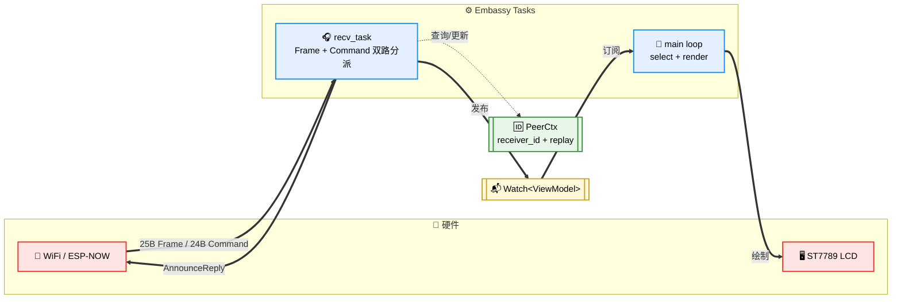
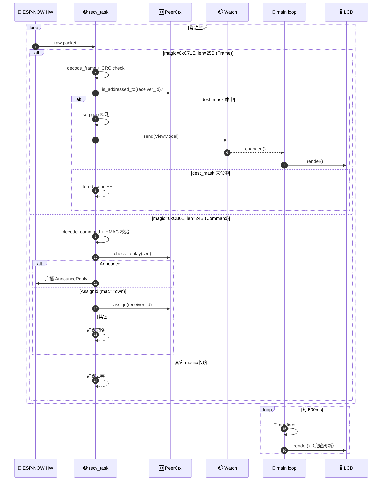

<div align="center">

# 🎮 c6

### ESP32-C6 Controller Receiver · ESP-NOW · ST7789 LCD

**基于 ESP32-C6 的 ESP-NOW 手柄状态接收器**
实时把远端手柄的按键 / 摇杆 / 旋钮状态渲染到 1.3 寸 240×240 ST7789 LCD 上。

[](rust-toolchain.toml)
[](Cargo.toml)
[](rust-toolchain.toml)
[](https://www.espressif.com/en/products/socs/esp32-c6)
[](LICENSE)

[](https://docs.rust-embedded.org/book/intro/no-std.html)
[](https://embassy.dev)
[](https://github.com/esp-rs/esp-hal)
[](https://defmt.ferrous-systems.com/)
[](https://probe.rs/)

[✨ 功能特性](#-功能特性) ·
[🔌 硬件接线](#-硬件与接线) ·
[🏗 软件架构](#-软件架构) ·
[🩺 POST 自检](#-post-自检) ·
[🔐 依赖注入密钥](#-依赖注入密钥) ·
[⚡ 快速开始](#-快速开始) ·
[❓ FAQ](#-常见问题)

</div>

---

## 📌 项目简介

`c6` 是一个 **端到端** 的嵌入式接收端参考实现：手柄侧通过 ESP-NOW 广播 25 字节
[`controller-protocol`](https://github.com/lf-wxp/controller) **v0.2.0** `Frame`，
`c6` 常驻监听并将其解码为 `ViewModel`，通过 `embassy_sync::Watch` 派发到 UI 协程实时刷屏。
**零连接握手、亚毫秒级唤醒、单 crate 单 firmware**。

<table>
<tr>
<td align="center" width="25%"><b>🧠 MCU</b><br/>ESP32-C6-Mini-1</td>
<td align="center" width="25%"><b>📡 Radio</b><br/>ESP-NOW（免连接广播）</td>
<td align="center" width="25%"><b>🎨 Display</b><br/>ST7789 240×240 SPI</td>
<td align="center" width="25%"><b>⚙️ Runtime</b><br/>embassy async · no_std</td>
</tr>
</table>

---

## 📑 目录

- [🎮 c6](#-c6)
    - [ESP32-C6 Controller Receiver · ESP-NOW · ST7789 LCD](#esp32-c6-controller-receiver--esp-now--st7789-lcd)
  - [📌 项目简介](#-项目简介)
  - [📑 目录](#-目录)
  - [✨ 功能特性](#-功能特性)
    - [🖼 UI 组件详解](#-ui-组件详解)
  - [🔌 硬件与接线](#-硬件与接线)
  - [🏗 软件架构](#-软件架构)
    - [🔄 数据流](#-数据流)
    - [⏱ 时序图](#-时序图)
  - [🩺 POST 自检](#-post-自检)
  - [� SD 卡](#-sd-卡)
    - [使用注意](#使用注意)
  - [�🔐 依赖注入密钥](#-依赖注入密钥)
  - [⚡ 快速开始](#-快速开始)
  - [🛠 构建 / 烧录 / 运行](#-构建--烧录--运行)
      - [🔍 检查与格式化](#-检查与格式化)
      - [🔨 构建](#-构建)
      - [📥 烧录与调试](#-烧录与调试)
      - [🧪 CI](#-ci)
  - [📁 目录结构](#-目录结构)
  - [❓ 常见问题](#-常见问题)
  - [🤝 贡献](#-贡献)
  - [🙏 致谢](#-致谢)
  - [📄 License](#-license)

---

## ✨ 功能特性

> **🆕 已适配 `controller-protocol` v0.2.0**（breaking）：帧长 21B → **25B**、
> 新增 `dest_mask` 位图寻址、按键位从 4 键扩到 **6 键**（Btn1-4 + JoyBtn + Switch）、
> `GamepadState.buttons` 由 `u8` → `u16`。上层 API（`FRAME_LEN` / `decode_frame`
> / `Frame::new` / `GamepadState::EMPTY`）保持兼容，接入方**零改动**。

| 模块 | 能力 | 状态 |
|---|---|:-:|
| 🩺 POST 自检 | Heap / LCD / **SD** / Codec / Wifi / EspNow / Watch 七项子系统健康度可视化 | ✅ |
| 📡 ESP-NOW 接收 | 自动匹配 25B `Frame`，非本协议报文静默丢弃 | ✅ |
| 🛡 协议校验 | CRC-16 校验、magic / 版本校验、seq gap 检测（丢包计数） | ✅ |
| 🎯 dest_mask 过滤 | 基于 `receiver_id` 的 `dest_mask` 位图寻址过滤 | ✅ |
| 🔐 Command 控制面 | 接收 24B Command（`0xCB01`）：Announce / AssignId 两路处理 | ✅ |
| � AnnounceReply | 收到 `Announce` 后广播 `AnnounceReply { mac, role_tag=b"lcd" }` 供手柄发现 | ✅ |
| 🆔 AssignId | 手柄下发 `AssignId { mac, receiver_id }` 动态分配逻辑 ID（0..=31） | ✅ |
| 🛡 抗重放窗口 | 64 位滑动窗 `AntiReplayWindow`，防止 Command 重放攻击 | ✅ |
| �🖼 实时渲染 | 按键 / 摇杆 / 旋钮全字段实时刷屏 | ✅ |
| 💧 兜底刷新 | 500ms 兜底重绘，永远不会"卡屏" | ✅ |
| 🔊 声光反馈 | RGB LED / 蜂鸣器状态提示 | 🚧 |
| 📥 Command 下发 | Host → 手柄反向控制通道 | 🚧 |
| 💾 SD 卡读取 | 挂载 FAT16/FAT32、枚举根目录、按需读文件 | ✅ |
| 💾 SD 卡录制回放 | 把 `Frame` 流写入 SD 卡以供离线回放 | 🚧 |

### 🖼 UI 组件详解

```
┌───────────────────────────────┐
│ [RECV] seq=1234  gap=0  ok=99 │  ← 顶部状态栏
├───────────────────────────────┤
│                               │
│  ┌──┐┌──┐┌──┐┌──┐┌──┐┌──┐     │  ← 6 按键（B1-B4 + JB/SW）
│  │B1││B2││B3││B4││JB││SW│     │      按下 = 绿色高亮
│  └──┘└──┘└──┘└──┘└──┘└──┘     │
│                               │
│           ╭───╮               │
│           │ • │  X=+128       │  ← 摇杆十字准星
│           ╰───╯  Y=-064       │
│                               │
│     K1 ▓▓▓▓▓▓░░░░  32768      │  ← 双旋钮进度条
│     K2 ▓▓▓░░░░░░░  16384      │
│                               │
│ id=3*  filt=12  rep=2          │  ← 底部 peer 状态行
└───────────────────────────────┘
```

> **底部状态行说明**：`id=N` 为当前 receiver_id，`*` 表示已被手柄 AssignId 分配（`.` 为初始占位），
> `filt` 为被 dest_mask 过滤的帧数，`rep` 为已发出的 AnnounceReply 次数。

---

## 🔌 硬件与接线

**板子**：ESP32-C6-Mini-1
**LCD**：1.3 寸正方形 SPI ST7789（240×240），通过 SPI2 直连（与 SD 卡共用 MOSI/CLK）。

<details open>
<summary><b>📋 完整引脚映射表</b></summary>

| 分类 | 功能 | GPIO | 备注 |
|:-:|:--|:-:|:--|
| 🖥 **LCD** | MOSI | `GPIO6` | 与 SD 共用 |
| 🖥 **LCD** | SCLK | `GPIO7` | 与 SD 共用 |
| 🖥 **LCD** | CS | `GPIO14` | 独立片选 |
| 🖥 **LCD** | DC | `GPIO15` | 数据/命令切换 |
| 🖥 **LCD** | RES | `GPIO21` | 复位 |
| 🖥 **LCD** | BL | `GPIO22` | 背光（软件拉高开启） |
| 💡 **LED** | RGB / WS2812 | `GPIO8` | 当前未使用 |
| 🔌 **USB** | D- / D+ | `GPIO12` / `GPIO13` | 硬件保留 |
| 📞 **UART0** | TX / RX | `GPIO16` / `GPIO17` | 串口 |
| 💽 **SD** | CS | `GPIO4` | 独立片选 |
| 💽 **SD** | MISO | `GPIO5` | SD 专用，LCD 不接 |
| 💽 **SD** | MOSI / SCLK | `GPIO6` / `GPIO7` | **与 LCD 共用** |

</details>

> **💡 Tip**：若 LCD 显示颜色反转或方向错误，在 [`main.rs`](src/bin/main.rs) 里调整
> `ColorInversion` 和 `Rotation`。

---

## 🏗 软件架构



### 🔄 数据流

1. **`recv_task`** — 常驻协程（双路分派）
   - **Frame 通路**（25B `0xC71E`）：`decode_frame` → `dest_mask` 过滤 → seq gap 检测 → 更新 `ViewModel` → `Watch::send`
   - **Command 通路**（24B `0xCB01`）：`decode_command` → 抗重放窗口 → `Announce`（广播 `AnnounceReply`）/ `AssignId`（更新 `PeerCtx.receiver_id`）
2. **主循环** — 双源触发
   `select(Watch.changed(), Timer(500ms))` → `render()` 全屏重绘
3. **中间通道** — 零拷贝广播
   `embassy_sync::watch::Watch<CriticalSectionRawMutex, ViewModel, 1>`
4. **PeerCtx** — 控制面上下文
   存放 `receiver_id`（动态分配）+ `AntiReplayWindow`（64 位滑动窗），纯内存态、重启自愈

### ⏱ 时序图



---

## 🩺 POST 自检

上电后、进入主循环前，**逐项走完七项子系统自检**，每完成一项即刷屏。
**关键项失败会永久停在自检页并报警**（SD 卡为可选项，失败不阻塞），避免设备“看似正常但没数据”的疑难症状。
| # | 项目 | 检测方式 | 失败原因示例 |
|:-:|:--|:--|:--|
| 1️⃣ | 🧠 `HEAP` | `Vec::with_capacity(512)` 分配是否成功 | `alloc<512B` |
| 2️⃣ | 🖥 `LCD` | 走到 render 阶段即认为 OK | — |
| 3️⃣ | 💽 `SDCARD` ⚠ | `SdCard::num_bytes` + FAT `open_volume` | `no card` / `no FAT` |
| 4️⃣ | 🔐 `CODEC` | `encode_frame → decode_frame` 环回<br/>（间接验证 CRC / HMAC / 密钥） | `decode err` |
| 5️⃣ | 📡 `WIFI` | `esp_radio::wifi::new` 返回值 | `init err` |
| 6️⃣ | 📻 `ESPNOW` | `interfaces.esp_now.split()` | — |
| 7️⃣ | 📬 `WATCH` | `Watch::receiver()` 能拿到订阅槽位 | `no slot` |
> ⚠ **带⚠的项为可选**：SD 卡失败仅作屏幕警示，不阻塞主流程；其余项失败则停机。

<details>
<summary><b>🖼 自检界面示意</b></summary>

```
┌────────────────────────────┐
│       SELF-TEST            │
├────────────────────────────┤
│ HEAP    [ OK ]             │
│ LCD     [ OK ]             │
│ SDCARD  [ OK ]  8192 MiB   │
│ CODEC   [ OK ]             │
│ WIFI    [ OK ]             │
│ ESPNOW  [ OK ]             │
│ WATCH   [ OK ]             │
├────────────────────────────┤
│ ALL OK                     │
└────────────────────────────┘
```

</details>

---

## � SD 卡

**硬件层**：SD 卡与 LCD **共用** `SPI2` 的 `MOSI(GPIO6) / SCLK(GPIO7)`，
自己的独有引脚为 `MISO(GPIO5) / CS(GPIO4)`。

**软件层**：使用 [`embedded-sdmmc`](https://crates.io/crates/embedded-sdmmc) 0.9
提供 FAT16 / FAT32 支持。为让 LCD 与 SD 共享同一条 `SpiBus`，采用了
`embedded_hal_bus::spi::RefCellDevice`：

```rust
static SPI_BUS: StaticCell<RefCell<Spi<'static, Blocking>>> = StaticCell::new();
let spi_bus = SPI_BUS.init(RefCell::new(spi));

// LCD 从共享总线借一路 SpiDevice
let lcd_spi = RefCellDevice::new(spi_bus, lcd_cs, Delay::new())?;

// SD 卡从同一总线借另一路
let sd_spi = RefCellDevice::new(spi_bus, sd_cs, Delay::new())?;
let sd    = embedded_sdmmc::SdCard::new(sd_spi, Delay::new());
```

> ⚠️ **共享总线频率折中**：目前总线频率取 20 MHz（SD 卡上限 25 MHz、LCD 上限
> 40 MHz 的稳妥交集）。如需极致 LCD 刷新率可拆到不同 SPI 外设。

### 使用注意

- SD 卡必须格式化为 **FAT16 / FAT32**（其它文件系统不支持）
- 未插卡启动完全允许，自检页会显示 `SDCARD [FAIL] no card` 但不停机
- SD 卡访问是**阻塞**的，如需在主循环使用请放到独立 task 避免影响渲染

---

## �🔐 依赖注入密钥

`controller-protocol` 关闭了 `embed-default-secrets`，**必须**通过编译期环境变量注入 HMAC 密钥（32 字节 UTF-8 字符串）。
在 [`.cargo/config.toml`](.cargo/config.toml) 的 `[env]` 段配置：

```toml
[env]
CONTROLLER_SECRET_V1 = "YOUR_32_BYTE_SECRET_KEY_V1_HERE!"
CONTROLLER_SECRET_V2 = "YOUR_32_BYTE_SECRET_KEY_V2_HERE!"
```

> ⚠️ **注意**：Frame 广播不做 HMAC 校验，密钥错误不会影响本项目现有功能；
> 但若未来加入 Command 下发（Host → 手柄），**收发两端密钥必须完全一致**。

> 🔒 **生产环境**：务必替换成 32 字节高熵密钥，详见 [`controller-protocol/USAGE.md`](https://github.com/lf-wxp/controller/blob/main/crates/protocol/USAGE.md)。

---

## ⚡ 快速开始

```bash
# 1️⃣ 克隆项目
git clone https://github.com/YOUR_USER/c6.git && cd c6

# 2️⃣ 检查 toolchain（已固化 nightly + riscv32imac-unknown-none-elf）
rustup show

# 3️⃣ 安装烧录/调试工具（一次性）
cargo install cargo-make espflash probe-rs-tools

# 4️⃣ 连接开发板 → 一键烧录 + 实时日志
cargo make run
```

---

## 🛠 构建 / 烧录 / 运行

所有工作流已封装到 [`Makefile.toml`](Makefile.toml)，**日常只需要记两条**：

```bash
cargo make check       # ✅ 快速类型检查
cargo make run         # 🚀 probe-rs 烧录 + 实时 defmt 日志
```

<details>
<summary><b>📖 完整命令一览（点击展开）</b></summary>

#### 🔍 检查与格式化
| 命令 | 说明 |
|---|---|
| `cargo make check` | `cargo check`（dev） |
| `cargo make check-release` | `cargo check --release` |
| `cargo make fmt` | 格式化 |
| `cargo make fmt-check` | 校验格式，不写入 |
| `cargo make clippy` | clippy `-D warnings`（仅 lib + bin） |
| `cargo make lint` | `fmt-check` + `clippy` |

#### 🔨 构建
| 命令 | 说明 |
|---|---|
| `cargo make build` | dev 构建 |
| `cargo make release` | release 构建 |
| `cargo make size` | 展示 release 产物 size |
| `cargo make tree` | `cargo tree` |
| `cargo make clean` | `cargo clean` |

#### 📥 烧录与调试
| 命令 | 说明 |
|---|---|
| `cargo make flash` | espflash 烧录 release（不 monitor） |
| `cargo make flash-monitor` | espflash 烧录 release 并 monitor |
| `cargo make run` | probe-rs 烧录 + 运行（release） |
| `cargo make run-dev` | probe-rs 烧录 + 运行（dev） |
| `cargo make monitor` | 仅串口 monitor |
| `cargo make erase` | 擦除整片 flash |

#### 🧪 CI
| 命令 | 说明 |
|---|---|
| `cargo make ci` | `fmt-check` + `clippy` + `build` + `release` |
| `cargo make` | 默认：`check` |

</details>

---

## 📁 目录结构

```text
c6/
├── 📂 .cargo/
│   └── config.toml         # target 三元组 + runner + 密钥环境变量
├── 📂 src/
│   ├── 📂 bin/
│   │   └── main.rs         # 🚀 顶层：外设初始化 + POST + 主循环
│   ├── lib.rs              # 模块导出
│   ├── display.rs          # 🎨 LCD 渲染（ViewModel / render / render_self_test）
│   ├── peer.rs             # 🆔 Peer 控制面上下文（receiver_id + AntiReplayWindow）
│   ├── post.rs             # 🩺 POST 自检入口
│   ├── radio.rs            # 📡 ESP-NOW 接收 task（Frame + Command 双路分派）
│   ├── sdcard.rs           # 💽 SD 卡 TimeSource / 辅助日志
│   └── self_test.rs        # 🩺 POST 自检核心
├── 📂 tests/
│   └── hello_test.rs       # embedded-test 占位（当前 [[test]] harness = false）
├── Cargo.toml
├── Makefile.toml           # cargo-make 任务集
├── build.rs
├── rust-toolchain.toml
└── README.md
```

---

## ❓ 常见问题

<details>
<summary><b>🖥 Q1: 屏幕黑屏 / 花屏？</b></summary>

优先确认：
1. 接线是否正确（尤其 `DC` / `RES`）
2. 背光 `GPIO22` 是否被拉高

如颜色反 / 方向错，在 [`main.rs`](src/bin/main.rs) 里调整：
- `ColorInversion::Inverted` → `Normal`
- `Rotation::Deg0` → `Deg90` / `Deg180` / `Deg270`

</details>

<details>
<summary><b>🔐 Q2: 自检 <code>CODEC [FAIL] decode err</code>？</b></summary>

`CONTROLLER_SECRET_V1` / `V2` 未注入或长度不是 32 字节。
检查 [`.cargo/config.toml`](.cargo/config.toml) 的 `[env]` 段。

</details>

<details>
<summary><b>📡 Q3: 自检全通过，但屏上一直 <code>WAIT</code>？</b></summary>

设备本身没问题，只是**没人在同一个 WiFi 信道上广播 25B Frame**。

排查步骤：
- ✅ 手柄端是否上电
- ✅ `ButtonBits` 序号是否正确
- ✅ 双方是否处于同一 WiFi 信道（默认 channel 1）

如需切换信道，见 `EspNow::set_channel`。

</details>

<details>
<summary><b>🧪 Q4: <code>cargo make clippy</code> 报 <code>can&#39;t find crate for test</code>？</b></summary>

`cargo clippy --all-targets` 会把 `no_std` 项目的 test target 也拉进来。
本项目已在 `Makefile.toml` 里改成 `--lib --bins`，如自己调用 clippy 请照做：

```bash
cargo clippy --lib --bins -- -D warnings
```

</details>

<details>
<summary><b>💽 Q5: SD 卡插入但自检报 <code>SDCARD [FAIL] no card</code>?</b></summary>

排查步骤：

1. 确认 SD 卡已格式化为 **FAT16 / FAT32**（不支持 exFAT / NTFS）
2. 确认接线：`MISO=GPIO5` / `CS=GPIO4` / `MOSI=GPIO6` / `SCLK=GPIO7`
3. 部分老 SD 卡对 3.3V 供电敏感，建议探测主板供电能力
4. 尝试调低 SPI 总线频率，在 [`main.rs`](src/bin/main.rs) 里将
   `Rate::from_mhz(20)` 改为 `Rate::from_mhz(4)` 后再试

</details>

<details>
<summary><b>💽 Q6: <code>SDCARD [FAIL] no FAT</code> 是什么意思？</b></summary>

SD 卡硬件握手成功但未发现可识别的 FAT 分区，常见原因：

- 未格式化（新卡）
- 格式化为 exFAT / NTFS / ext4
- 分区表损坏

用 SD Card Formatter 或 `mkfs.vfat -F 32 /dev/sdX` 重新格式化为 FAT32 即可。

</details>

---

## 🤝 贡献

欢迎 PR！请在提交前跑通：

```bash
cargo make ci    # fmt-check + clippy + build + release
```

**提交规范**：建议使用 [Conventional Commits](https://www.conventionalcommits.org/)。

---

## 🙏 致谢

本项目建立在以下优秀开源工作之上：

- 🦀 [**esp-rs**](https://github.com/esp-rs) — ESP32 Rust 生态基石
- ⚡ [**embassy**](https://embassy.dev) — 优雅的 no_std 异步运行时
- 🎨 [**mipidsi**](https://github.com/almindor/mipidsi) — ST7789 驱动
- 🖼 [**embedded-graphics**](https://github.com/embedded-graphics/embedded-graphics) — 嵌入式 2D 渲染
- 🎮 [**controller-protocol**](https://github.com/lf-wxp/controller) — 手柄协议定义
- 💽 [**embedded-sdmmc**](https://github.com/rust-embedded-community/embedded-sdmmc-rs) — FAT16 / FAT32 SD 卡驱动
- 📡 [**probe-rs**](https://probe.rs/) — 一站式嵌入式调试工具链

---

## 📄 License

<div align="center">

**MIT** © c6 contributors

见 [LICENSE](LICENSE)。

<sub>Built with 🦀 Rust · Powered by ⚡ embassy · Made for ESP32-C6</sub>

</div>
